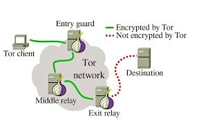
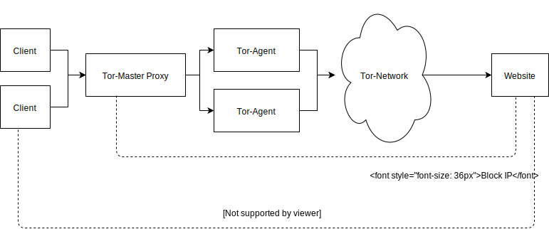
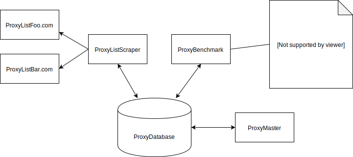

import { Head } from 'mdx-deck'
const BS = ()=>"\\";
export { default as theme } from './theme'


<Head>
  <title>Who Puppeteers the Puppetteer?</title>
</Head>

# Who Puppeteers the Puppetteer? 
## A Story about Proxies and Botnetworks 

---

# Thought Experiment

## How can we scrape data from a large website as quickly as possible?

---

# Challange: API Rate Limits

- By Account
- By Ip(-range)


---

# Solution: Use Many IPs

---

# Tor?



---

# Tor!

```js
// yarn add Tor-Master
const {createTorAgent} = require('tor-master');

const agent = await createTorAgent();
const myIP =  await agent.get('https://api.ipify.org');
await agent.changeIP();
const myNewIP = await agent.get('https://api.ipify.org');
await agent.kill();
```

---

# Create Meta-Proxy




---

# Does it Work? 
## It depends ...

---

# Attempt 2: Scrape Dodgy Free ProxyLists

---



---

# Why Do Free Proxies Exist?

---

# Does it Work? 
## Yes but ...

---

# Are there better ways?

- Dedicated Servers eg. AWS
- AWS Lambda

---

# Chrome Plugin
